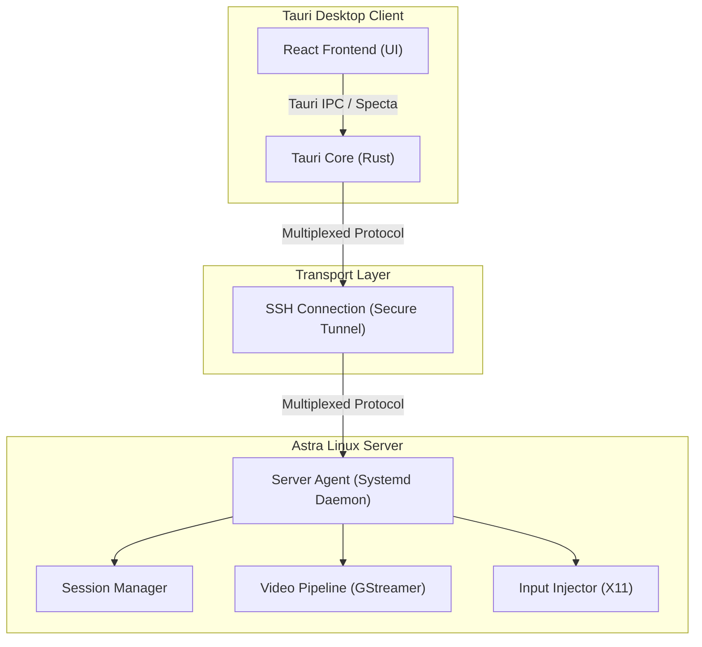

# System Architecture — TTGTiSO-Desk

This document outlines the high-level architecture of the TTGTiSO-Desk remote desktop system.

## 1. High-Level Architecture Overview

TTGTiSO-Desk follows a modular, client-server design based on **Clean Architecture** and **Ports & Adapters (Hexagonal)** principles. It uses SSH as a secure transport layer and runs a custom multiplexed protocol (TTGTiSO Protocol) over it.

### System Overview Diagram



---

## 2. Technology Stack & Key Subsystems

### 2.1. Client Stack
- **Frontend UI:** React 18, TypeScript, TailwindCSS/Vanilla CSS, Lucide React (Icons).
- **Desktop Runtime:** Tauri v2 (incorporating Rust for backend bindings and system interactions).
- **Communication Bridge:** Tauri IPC with Specta for type-safe bindings between Rust and TypeScript.

### 2.2. Server Stack
- **Core Engine:** Rust (safe, concurrent, fast).
- **SSH Protocol:** `russh` or `ssh2` crates.
- **Video Pipeline:** GStreamer (Rust bindings `gstreamer-rs`) with H.264 (VAAPI & OpenH264/x264).
- **Session Control:** custom session controller spawning separate X11 server displays (via Xvfb, Xorg or Fly-specific DM launchers).
- **Input Injection:** `x11rb` / `libxtst` wrappers for virtual mouse/keyboard controls.

---

## 3. Communication & Multiplexing

TTGTiSO-Desk multiplexes multiple logical channels over a single SSH session connection. This enables compliance with strict firewall rules where only the SSH port is exposed.

### Client-Agent-Relay Interaction

When a direct connection is not possible, a Relay Server acts as a bastion. It routes traffic through a single port without decrypting payload if end-to-end SSH encryption is used.

```mermaid
sequenceDiagram
    autonumber
    actor User as Client User
    participant Client as Tauri Client
    participant Relay as Relay/Bastion (Optional)
    participant Agent as Server Agent
    participant Session as User X11 Session

    User->>Client: Connect (Host info, credentials)
    alt Direct Mode
        Client->>Agent: Establish SSH session
    else Relay Mode
        Client->>Relay: Establish SSH tunnel to Relay
        Relay->>Agent: Forward SSH connection to Agent
    end
    Agent-->>Client: SSH Auth Successful
    Client->>Agent: Send Control: Start Session
    Agent->>Agent: Create User X11 Session
    Agent->>Session: Spawns Xvfb / Fly Desktop
    Agent-->>Client: Control: Session Started (Display ID)
    par Video Stream
        Agent->>Client: Send video frames (H.264 stream)
    and Input Control
        Client->>Agent: Send mouse/keyboard events
        Agent->>Session: Inject input events
    and Clipboard Sync
        Client<->>Agent: Clipboard updates
    end
```

---

## 4. Architectural Rules & Modularity

To ensure maintainability and strict separation of concerns, the project enforces:
1. **Low Coupling:** Subsystems (video, input, security, session manager) interact through traits defined in shared crates.
2. **File Size Limits:** No Rust or TypeScript file may exceed **250 lines**. Any code exceeding this limit must be refactored into smaller sub-modules.
3. **No God Objects:** Monolithic classes/structs managing multiple concerns are strictly prohibited.
4. **Isolated UI Components:** All UI components in React must be structured into self-contained directories with a matching CSS module and test file.
