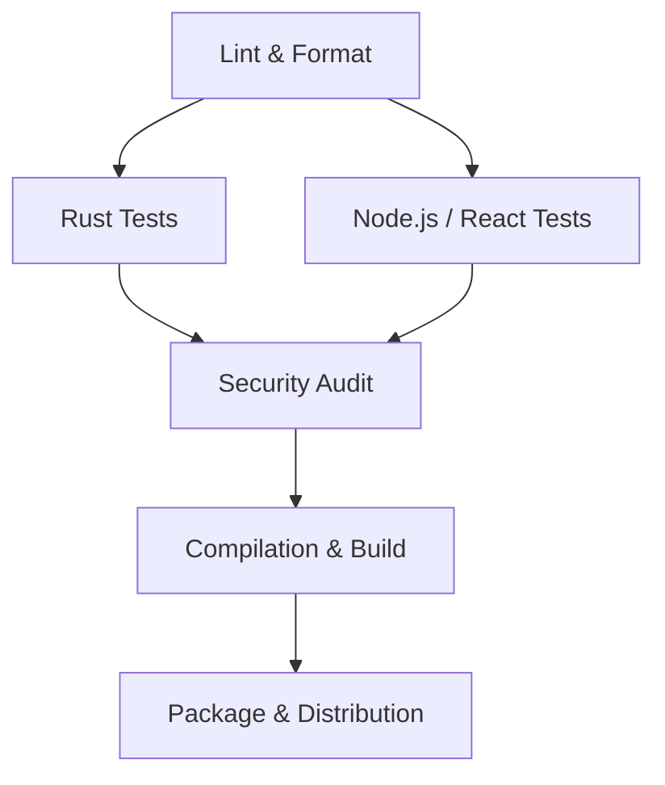

# Continuous Integration (CI/CD) Strategy

This document outlines the pipeline stages, security verification steps, and automated packaging flow used in the build cycle.

---

## 1. Pipeline Architecture

Every pull request and change committed to main branches triggers the CI pipeline. The pipeline contains the following key stages:



---

## 2. Pipeline Stages

### 2.1. Format Check & Linting
Enforces code styles and static analysis guidelines:
* **Rust**:
  ```bash
  cargo fmt -- --check
  cargo clippy -- -D warnings
  ```
* **Frontend**:
  ```bash
  npm run lint
  ```

### 2.2. Test Execution
Runs the complete test suite:
* **Rust Backend**:
  ```bash
  cargo test --all-targets --all-features
  ```
* **React UI**:
  ```bash
  npm run test
  ```

### 2.3. Security Audit
Automated security vulnerability scanner on third-party dependencies:
```bash
cargo audit
```

### 2.4. Build Compilation
Builds production artifacts:
* **Server Agent (Rust)**:
  ```bash
  cargo build --release -p server-agent
  ```
* **Desktop Client (Tauri/Vite)**:
  ```bash
  cd apps/desktop-client
  npm run build
  ```

### 2.5. Packaging Skeleton
Creates installer bundles and updates standard packages:
* Compresses binaries, configuration defaults, and systemd definitions.
* Generates `.deb` package skeletons for debian-compliant distributions.

---

## 3. GitHub Actions Workflow Configuration

The pipeline is defined in [.github/workflows/ci.yml](file:///.github/workflows/ci.yml). It automates all linting, testing, and compilation stages cleanly on Ubuntu and Debian runner targets.
