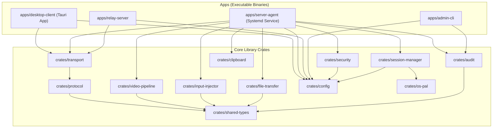
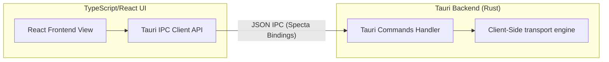
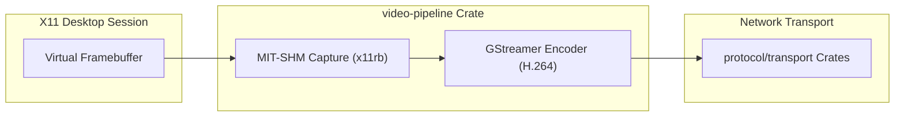

# Component Diagrams — TTGTiSO-Desk

This document shows component dependencies and interactions inside the TTGTiSO-Desk repository.

## 1. Monorepo Dependency Tree

The diagram below maps how crates and packages relate to each other. Directed arrows show compilation dependencies (`A --> B` means A depends on B).

---

## 2. Dynamic Component Subsystems

### 2.1. Client UI and Backend Bridge (Tauri IPC)

### 2.2. Session Capture and Compression Loop

