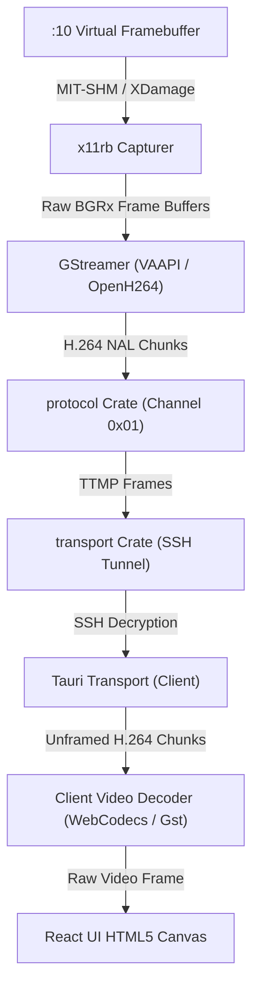
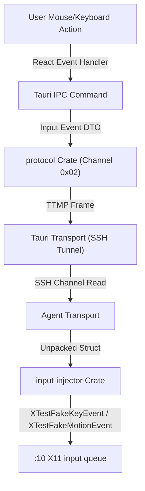
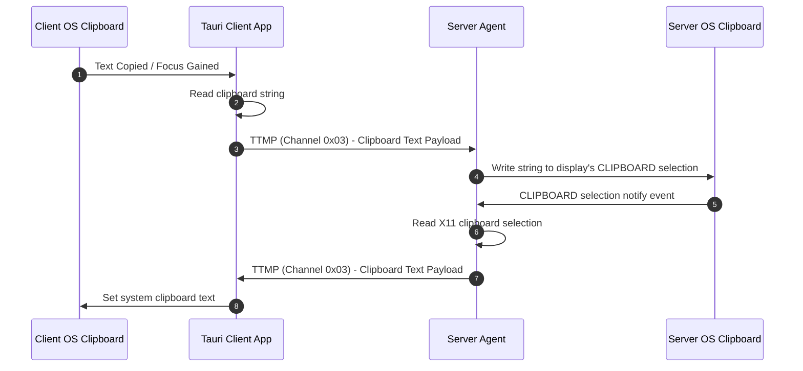
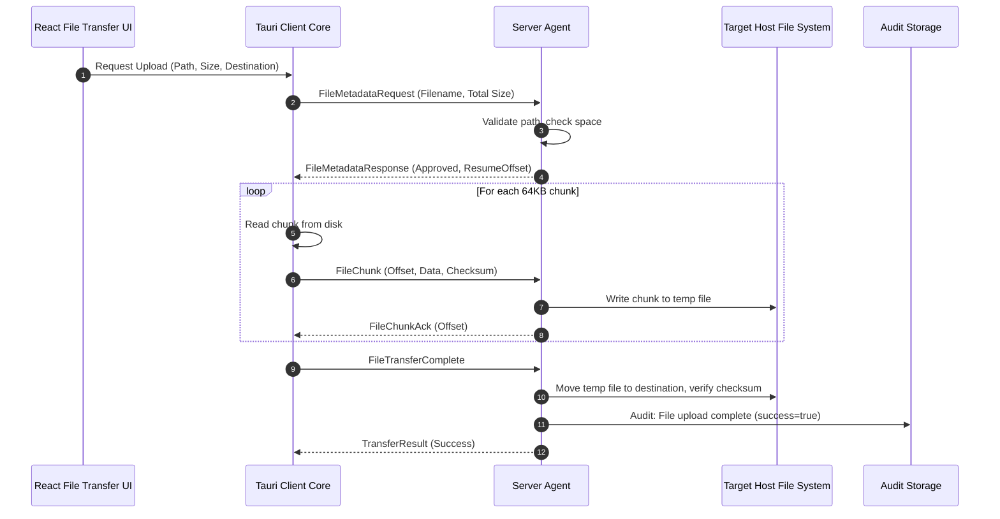

# Data Flow Diagrams — TTGTiSO-Desk

This document outlines the detailed sequence and structure of data routing within TTGTiSO-Desk.

## 1. Video Streaming Pipeline (Server -> Client)

The video streaming data flow processes virtual framebuffer changes, encodes them, frames them in TTMP, and pushes them down the SSH channel.

---

## 2. Input Injection Pipeline (Client -> Server)

Input actions (clicks, drags, keyboard hotkeys) are serialized in the client UI and sent to the server for emulation.

---

## 3. Clipboard Synchronization (Bi-directional)

Clipboard synchronization maintains consistency between client and host clipboard spaces.

---

## 4. File Transfer (Upload: Client -> Server)

Files are split into fixed size chunks (e.g. 64KB) to avoid memory overload and sent over Channel 0x04.

