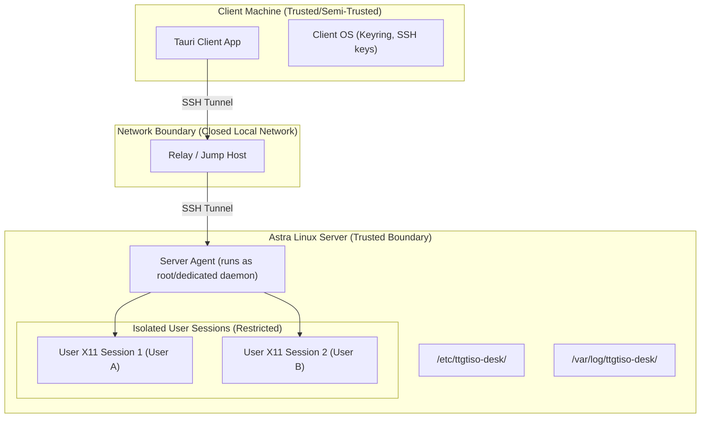

# Threat Model — TTGTiSO-Desk

This document identifies security boundaries, assets, threats, and mitigations for the TTGTiSO-Desk system, designed for high-security closed network environments.

## 1. Trust Boundaries

We identify three distinct trust boundaries:
1. **Client Host:** Contains user credentials, SSH private keys, and local application states.
2. **Network Boundary:** The local closed network, where traffic flows. While isolated from the internet, it is susceptible to insider threats.
3. **Server Host:** Houses the server agent (running with system privileges to manage sessions), user sessions, configurations, and audit logs.

---

## 2. Asset Identification

| Asset | Description | Impact of Compromise |
| :--- | :--- | :--- |
| **User Credentials & SSH Keys** | Private keys and passwords used to authenticate clients. | Critical (unauthorized access to server and sessions). |
| **Interactive Video Stream** | H.264 video feed sent from the server sessions to the client. | High (unauthorized visual inspection of sensitive data). |
| **Input Events Stream** | Mouse and keyboard inputs sent from client to server. | High (keystroke injection, interception of credentials). |
| **System Configurations** | Agent configurations in `/etc/ttgtiso-desk/agent.toml`. | High (malicious reconfiguration of privileges or logs). |
| **Audit Logs** | Historical records of connections, file transfers, and actions. | High (covering tracks of malicious operations). |

---

## 3. Threat Analysis (STRIDE Model)

### 3.1. Spoofing
- **Threat:** An attacker setting up a rogue server mimicking the target agent.
- **Mitigation:** Strict Host Key verification on the client. Keys must be verified out-of-band during the first connection (TOFU - Trust On First Use) or pre-configured.

### 3.2. Tampering
- **Threat:** An attacker modifying configuration files on the server to elevate privileges.
- **Mitigation:** Strict file permissions. `/etc/ttgtiso-desk/` and its files must be readable and writable only by `root` or a dedicated `ttgtiso-desk` system user.

### 3.3. Repudiation
- **Threat:** A malicious user performs an unauthorized action (e.g., copies a classified document) and denies it.
- **Mitigation:** Immutable, write-once audit log entries saved directly to `journald` and mirrored to a read-only secure local file.

### 3.4. Information Disclosure
- **Threat:** Eavesdropping on the video stream or keyboard inputs over the network.
- **Mitigation:** SSH transport encryption (AES-GCM or ChaCha20-Poly1305). Clipboard data is cleared from the remote server when the session terminates.

### 3.5. Denial of Service (DoS)
- **Threat:** A user spawning dozens of concurrent sessions to exhaust server memory and CPU.
- **Mitigation:** Strict connection/session limits per user configured in `agent.toml`. User sessions are bound to `systemd` slices to enforce CPU and memory limits.

### 3.6. Elevation of Privilege
- **Threat:** Escaping the isolated X11 session or utilizing the Server Agent to run commands as `root`.
- **Mitigation:** The X11 sessions run as the low-privileged local user corresponding to the authenticated client, NOT as `root`. The Server Agent uses strict IPC message validation.

---

## 4. Key Security Requirements for MVP

1. **Authentication:** Only SSH-key-based or secure local PAM authentication. No custom, unhashed passwords in configurations.
2. **Session Isolation:** Each graphical session runs under the context of the respective Unix user account.
3. **Audit Trails:** Every session initiation, teardown, file transfer, and clipboard sync must write an audit record with timestamp, source IP, user, and action.
