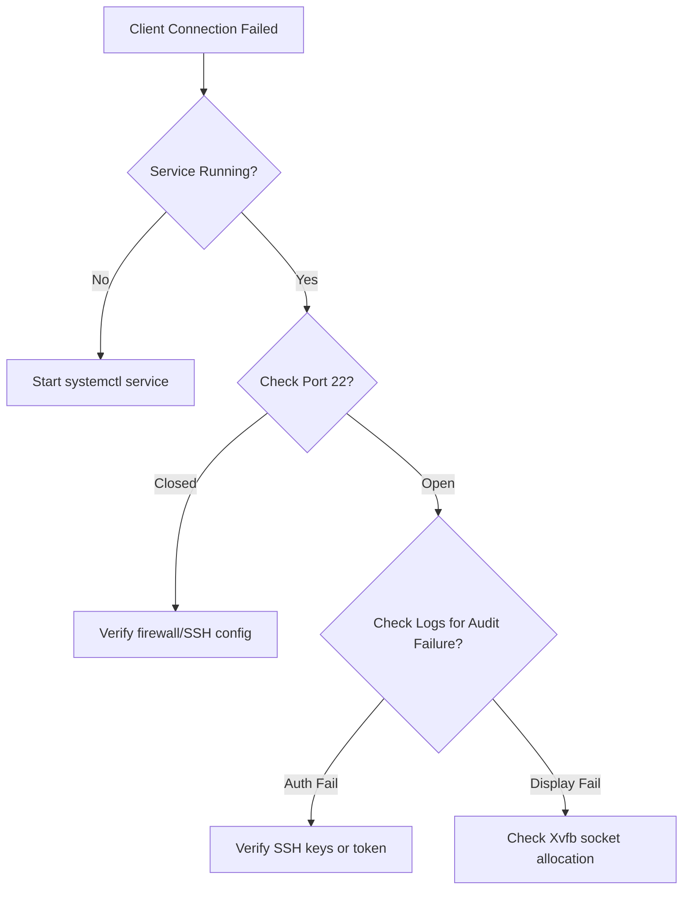

# Administrator Troubleshooting Guide

This guide helps administrators diagnose and resolve operational issues with the TTGTiSO-Desk Remote Desktop Server Agent and Relay Server.

---

## 1. Diagnostics Flow



---

## 2. Common Issues and Solutions

### Issue 1: Display Allocation Exhaustion
* **Symptom**: Client connection logs show `Failed to allocate X11 display ID` or `No free displays available`.
* **Cause**: Stale lock sockets at `/tmp/.X11-unix/` left behind by abnormally terminated Xvfb servers.
* **Resolution**:
  1. Clean up unused locks:
     ```bash
     sudo rm -f /tmp/.X10-lock /tmp/.X11-lock ...
     ```
  2. Restart the agent:
     ```bash
     sudo systemctl restart ttgtiso-desk-agent
     ```

### Issue 2: GStreamer VAAPI Encoder Failures
* **Symptom**: Connected clients receive a black screen or disconnect during the handshake. Logs show `GStreamer encoder error: VAAPI initialization failed`.
* **Cause**: Lack of hardware acceleration hardware/drivers in virtualized environments.
* **Resolution**:
  - The pipeline automatically falls back to OpenH264 (SoftwareFallbackEncoder). If the fallback fails, ensure `openh264` libraries are installed:
    ```bash
    sudo apt-get install -y libopenh264-6
    ```

### Issue 3: Relay Connection Heartbeat Expired
* **Symptom**: Relay logs output `Session expired due to heartbeat timeout`.
* **Cause**: Network latency or network connection dropped.
* **Resolution**:
  1. Verify network latency using `ping`.
  2. Increase the watchdog check limit `heartbeat_timeout_secs` in the relay configuration.
