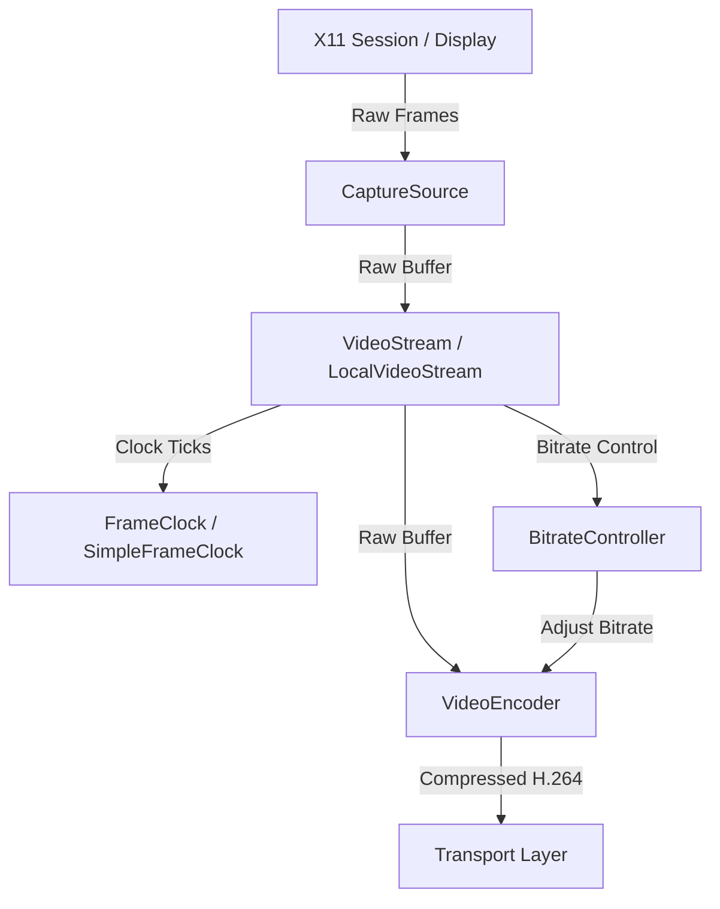

# Video Streaming Pipeline Design

This document details the video capture and encoding architecture designed to stream user remote desktop sessions with ultra-low latency.

## Architecture

## Key Components

1. **CaptureSource**:
   - Captures graphical frame buffers from the user's isolated X11 display.
   - Utilizes X11 shared memory (MIT-SHM) to copy frame buffers to memory without overhead.
   - Provides a `MockCaptureSource` for automated tests and platforms without X11.

2. **VideoEncoder**:
   - Compressed output format: H.264.
   - Primary: GStreamer encoder with VAAPI (Intel/AMD hardware acceleration) if present.
   - Secondary / Fallback: Software H.264 encoder (OpenH264) when hardware resources are busy or unavailable.

3. **BitrateController**:
   - Employs an AIMD-based (Additive Increase Multiplicative Decrease) algorithm.
   - Dynamically responds to network packet loss and spikes in latency to protect frame-rate consistency.

4. **FrameClock**:
   - Enforces a precise 30 FPS timing sequence.
   - Compensates for render and encoding jitter using dynamic sleeps.

## Fallback Sequence

If GStreamer initialization fails or encounters a pipeline error during startup:
1. Log an audit/warning event.
2. Initialize the Software Fallback encoder.
3. Reduce starting resolution/bitrate parameters if necessary to preserve CPU budget.
